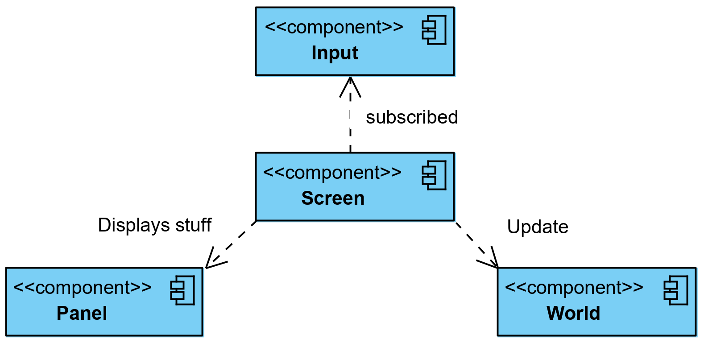
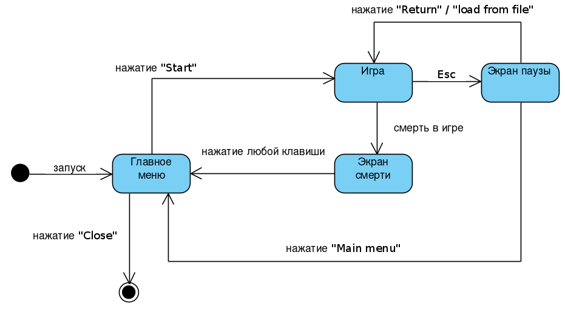

# Roguelike Design Document

## Общие сведения о системе

Вы - единственный, кто ещё не заразился модным вирусом, потому что вы послушались совета врачей и сидели дома. У вас закончилась еда и теперь вам нужно сходить в магазин и купить еды. На пути вас поджидает множество врагов - заражённые люди (гопники) и менты (они влепят штраф, если поймают на улице).

* Игрок может перемещаться по карте, сражаться с монстрами и собирать предметы
* Игрок существует в пределах карты и не может из нее выбраться
* Цель игры — пройти все уровни

## Architectural drivers

* Поддерживается только однопользовательский режим
* Игра происходит в графическом окне
* Игра должна требовать не более 1GiB в любой момент времени и отклик на любое действие должен быть не более 1 секунды
* Игра должна работать на Linux, MacOs и Windows (поддерживаются версии вышедшие не раньше двух лет назад)
* При игре не должно возникать ошибок

* Ключевые функциональные требования
    - При запуске игры появляется игровое меню с возможностью начать новую игру
    - При начале игры создаётся случайный игровой уровень с монстрами и предметами, в случайной клетке появляется игрок
    - Игровой уровень состоит из клеток
    - Игра состоит в последовательных ходах игрока и монстров. Игрок может сходить в любую из 4 соседних клеток
    - Игрок переходит на следующий уровень при уничтожении всех монстров
    - Игра завершается когда монстры убивают игрока (игрок имеет ограниченный запас здоровья)

## Роли и случаи использования

Ты – тру пограммист. И в перевыве между контестами и деплоями хайлоад приложений хочешь немного отдохнуть. В этом тебе поможет наша игра.

Наша целевая аудитория:
- Любители необычных rogue like
- Желающие скоротать время
- Программисты на карантине

Случаи использования:
- Быстрая игра (зайти, поиграть один уровень)
- Долгая игра (зайти, поиграть несколько уровней)

## Композиция (диаграмма компонентов)

- Input (Подсистема ввода)
- Screen (экран игрового меню, экран с игрой, экран смерти)
- World (Игровой мир/его состояние)

## Логическая структура (диаграмма классов)

   Screen - интерфейс, который дополняет MenuScreen и реализует GameScreen.  
   GameScreen - отображает текущее состояние игры.  
   PauseMenuScreen, PauseMenuScreen, PauseMenuScreen - реализуют MenuScreen и 
   выполняют соответствующий функционал.  
   World - каждый мир содержит множество игровых сущностей Entity, которые разбросаны по "ячейкам" мира.   
   Entity -  игровая сущность, которая располагается на экране.  
   Creature, Item, Obstacle - расширяют интерфейс Entity под необходимые нужды. 
   Данные интерфейсы реализуют дальнейшие объекты игрового мира.

## Screens

- Главное меню
    - Новая игра
    - Загрузить игру
    - Выйти из игры
- Меню паузы
    - Сохранить игру
    - Загрузить игру
    - Выйти в главное меню
- Меню смерти
    - Загрузить игру
    - Выйти в главное меню
- Экран игры
    - Игровое поле
    - Сбоку панель с логом событий и пространством для инвентаря

## Взаимодействия и состояния (диаграммы последовательностей и конечных автоматов)

Application передает пользователя Screen, тот в свою очередь обрабатывает действие и 
передает изменение World, после чего возвращает результат. Также Application запрашивает обновление Screen для прорисовки изображения.

User запускает игру и оказывается в главном меню. После чего он может начать игру, либо завершить ее. При переходе в Игру, User может перейти через Esc в состояние паузы, откуда может вернуться в игру, либо вернуться в главное меню. В случае смерти User'a выдается Экран смерти, откуда он возвращается в Главное меню.
